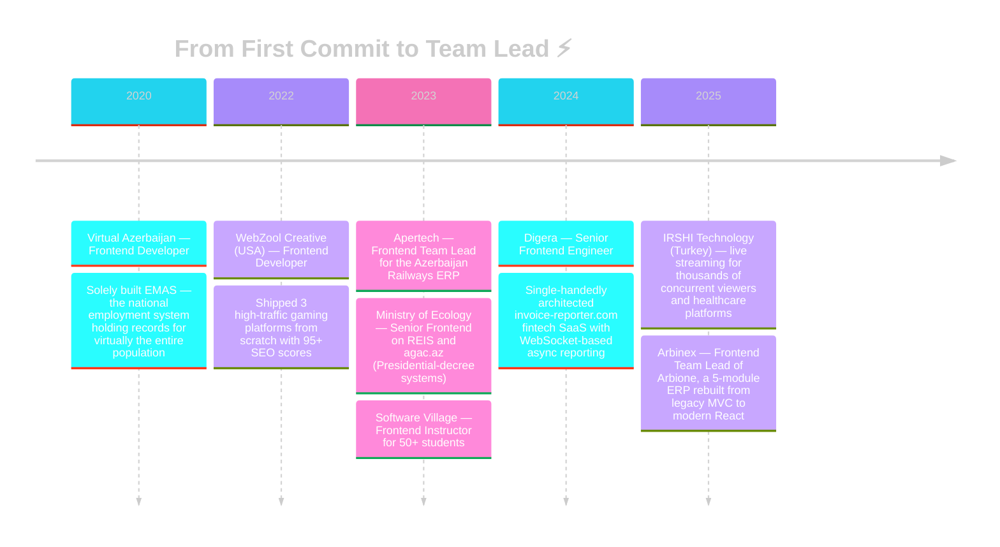

<!-- ═══════════════════════════ HEADER ═══════════════════════════ -->

<div align="center">
  
</div>

<div align="center">
  
</div>

<br/>

<div align="center">
  
  &nbsp;&nbsp;
  
  &nbsp;&nbsp;
  
  &nbsp;&nbsp;
  
</div>

<br/>


<br/>

<!-- ═══════════════════════════ ABOUT ═══════════════════════════ -->

##  &nbsp;About Me


```typescript
const haldun: SeniorFrontendEngineer = {
  name:       "Haldun Mammadzada",
  role:       "Frontend Team Lead @ Arbinex",
  location:   "🇦🇿 Baku, Azerbaijan",
  experience: "5+ years — from scratch to scale",

  battlegrounds: [
    "🏛️ GovTech  — national systems serving millions",
    "💳 Fintech  — SaaS products built end-to-end",
    "🎰 Gaming   — high-traffic, 95+ SEO platforms",
    "🏢 Enterprise — modular ERP architecture",
  ],

  arsenal: {
    frontend: ["React", "Next.js", "TypeScript",
               "Vue.js", "Angular"],
    motion:   ["Framer Motion", "Three.js"],
    backend:  ["Node.js", "Express", "PHP/Laravel",
               "WebSockets"],
    ai:       ["LLM APIs", "Groq", "Llama 3.3",
               "Prompt Engineering"],
  },

  superpowers: [
    "⚡ Rebuilding legacy systems into modern stacks",
    "🧩 Scalable component architecture & design systems",
    "🚀 Performance engineering & Core Web Vitals",
    "🎓 Mentoring devs into production-ready engineers",
  ],

  belief: "UI is not decoration — it is communication ✦",
};
```

<br clear="right"/>

<!-- ═══════════════════════════ IMPACT ═══════════════════════════ -->

<div align="center">

<table>
<tr>
<td align="center" width="16%">
  
  <br/><sub><b>Years of<br/>Engineering</b></sub>
</td>
<td align="center" width="16%">
  
  <br/><sub><b>Platforms<br/>Shipped</b></sub>
</td>
<td align="center" width="16%">
  
  <br/><sub><b>Citizens Served<br/>by My Frontends</b></sub>
</td>
<td align="center" width="16%">
  
  <br/><sub><b>SEO Scores on<br/>High-Traffic Sites</b></sub>
</td>
<td align="center" width="16%">
  
  <br/><sub><b>Developers<br/>Trained</b></sub>
</td>
<td align="center" width="16%">
  
  <br/><sub><b>Feature Delivery<br/>Time Cut</b></sub>
</td>
</tr>
</table>

</div>

<br/>


<br/>

<!-- ═══════════════════════════ TIMELINE ═══════════════════════════ -->

##  &nbsp;Career Journey



<br/>


<br/>

<!-- ═══════════════════════════ TECH ═══════════════════════════ -->

##  &nbsp;Tech Arsenal

<div align="center">

### ⚔️ &nbsp;Daily Weapons


<br/><br/>

### 🛡️ &nbsp;Full Spectrum


<br/><br/>


<br/><br/>

| &nbsp;&nbsp;Domain&nbsp;&nbsp; | Stack |
|:---:|:---|
| **🎨 Frontend** |        |
| **✨ Motion & 3D** |    |
| **⚙️ Backend & APIs** |       |
| **🤖 AI Integration** |     |
| **🧰 Tools & Practices** |       |

</div>

<br/>


<br/>

<!-- ═══════════════════════════ PROJECTS ═══════════════════════════ -->

##  &nbsp;Battle-Tested in Production

<div align="center">

| Project | Domain | What I Did | Stack |
|:---|:---:|:---|:---:|
| 🏢 **Arbione ERP** | Enterprise | Leading the rebuild of a 5-module ERP (HR · Finance · Inventory · GPS · KPIs) from legacy MVC — **-40% delivery time** | `React` `Laravel` `TS` |
| 🌳 **[agac.az](https://agac.az)** | GovTech | Presidential-initiative GIS registry mapping **every tree in the country** with individual QR codes | `React` `GIS` |
| 🌍 **REIS** | GovTech | Led frontend architecture of the national Digital Ecology Information System, commissioned by Presidential decree | `React` `TS` `Jest` |
| 💳 **[invoice-reporter.com](https://invoice-reporter.com)** | Fintech | Built the entire SaaS solo — WebSocket-based async PDF reporting with zero UI blocking | `Next.js` `WS` |
| 👥 **EMAS** | GovTech | Solely developed the UI of Azerbaijan's largest national employment system | `Angular` `TS` |
| 🎰 **bitspinwin · bitbetwin · win777** | Gaming | 3 US-market platforms from scratch — dynamic image resizing, **95+ SEO**, high concurrent traffic | `Next.js` `SEO` |
| 📺 **[spokrani.com](https://spokrani.com)** | Streaming | Live-streaming module serving **thousands of concurrent viewers** during live matches | `Vue.js` |
| 🏥 **[medicabil.com](https://medicabil.com)** | HealthTech | Admin dashboard, doctor cabinet & online appointment booking for a high-volume hospital | `Vue.js` |
| 🪪 **[xcard.az](https://xcard.az)** | SaaS | Digital business card platform — concept to production, solo | `Next.js` `Three.js` |
| 🚆 **ADY ERP** | Enterprise | Led the frontend team for Azerbaijan Railways' internal ERP system | `React` `TS` |

</div>

<br/>


<br/>

<!-- ═══════════════════════════ EXPERTISE ═══════════════════════════ -->

##  &nbsp;What I Bring to the Table

<div align="center">
<table>
<tr>
<td align="center" width="25%">

<br/><strong>Frontend Architecture</strong><br/>
<sub>Scalable component systems powering 5-module ERPs and nationwide platforms</sub>
</td>
<td align="center" width="25%">

<br/><strong>Performance Engineering</strong><br/>
<sub>95+ SEO, Core Web Vitals, async WebSocket pipelines, zero UI blocking</sub>
</td>
<td align="center" width="25%">

<br/><strong>Motion & 3D Interfaces</strong><br/>
<sub>Framer Motion & Three.js experiences that make products feel alive</sub>
</td>
<td align="center" width="25%">

<br/><strong>Leadership & Mentoring</strong><br/>
<sub>Leading teams, teaching 50+ devs — half now employed as professionals</sub>
</td>
</tr>
</table>
</div>

<br/>


<br/>

<!-- ═══════════════════════════ STATS ═══════════════════════════ -->

##  &nbsp;GitHub Intelligence

<div align="center">
  
</div>

<br/>

<div align="center">
  
  
</div>

<br/>

<div align="center">
  
</div>

<br/>

<div align="center">
  
</div>

<br/>


<br/>

<!-- ═══════════════════════════ SNAKE ═══════════════════════════ -->

##  &nbsp;Contribution Snake

<div align="center">
  <picture>
    <source media="(prefers-color-scheme: dark)" srcset="https://raw.githubusercontent.com/HaldunMammadzade/HaldunMammadzade/output/github-contribution-grid-snake-dark.svg"/>
    <source media="(prefers-color-scheme: light)" srcset="https://raw.githubusercontent.com/HaldunMammadzade/HaldunMammadzade/output/github-contribution-grid-snake.svg"/>
    
  </picture>
</div>

<br/>


<br/>

<!-- ═══════════════════════════ CONNECT ═══════════════════════════ -->

##  &nbsp;Let's Build Something Great

<div align="center">

<a href="https://haldunmammadzada.website">
  
</a>
&nbsp;
<a href="https://www.linkedin.com/in/haldun-mammadzada/">
  
</a>
&nbsp;
<a href="mailto:haldun.mammadzada@gmail.com">
  
</a>
&nbsp;
<a href="https://www.instagram.com/haldun__m/">
  
</a>
&nbsp;
<a href="https://t.me/haldun_mammadzade">
  
</a>

</div>

<br/>

<div align="center">
  
</div>

<br/>

<div align="center">
  
</div>

<div align="center">
  
</div>
