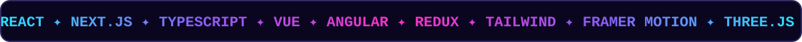

<!-- ══════════════════════════════════════════════════════════════
     HAND-CRAFTED PROFILE — every SVG in /assets is written by hand
     raw SVG + SMIL + CSS keyframes · no generators, no templates
════════════════════════════════════════════════════════════════ -->

<div align="center">
  
</div>

<div align="center">
  
</div>

<br/>

<div align="center">
  
  &nbsp;
  
  &nbsp;
  
  &nbsp;
  
</div>

<br/>


<br/>

## 🖥️ &nbsp;`$ ./haldun --interactive`

<div align="center">
  
</div>

<br/>


<br/>

## 🎨 &nbsp;`about-me.css`


```css
.haldun {
  display: inline-block;
  position: absolute;          /* Baku, Azerbaijan 🇦🇿 */
  role: "senior frontend engineer";
  craft: interfaces-you-can-feel;
  animation: shipping 5y+ infinite ease-in-out;
  transition: idea → production 0.3s;
  will-change: the-web;
  z-index: 9999;               /* always on top of the game */
}

.haldun::before {
  content: "⚡ pixel-perfect · motion-first · perf-obsessed";
}

.haldun::after {
  content: "🤖 teaching UIs to think with LLMs";
}

.haldun:hover {
  cursor: pointer;
  transform: scale(1.1);
  box-shadow: 0 0 60px #22e4ff;
  /* yes — i center divs for a living.
     even that one. especially that one. */
}
```

<br clear="right"/>

<br/>


<br/>

## ⚡ &nbsp;`<TechConstellation />`

<div align="center">
  
</div>

<br/>

<div align="center">
  
  <br/><br/>
  
  <br/><br/>
  
</div>

<br/>

<div align="center">
  
</div>

<br/>


<br/>

## 📡 &nbsp;`<Telemetry />`

<div align="center">
  
  
</div>

<br/>

<div align="center">
  
</div>

<br/>

<div align="center">
  <picture>
    <source media="(prefers-color-scheme: dark)" srcset="https://raw.githubusercontent.com/HaldunMammadzade/HaldunMammadzade/output/github-contribution-grid-snake-dark.svg"/>
    <source media="(prefers-color-scheme: light)" srcset="https://raw.githubusercontent.com/HaldunMammadzade/HaldunMammadzade/output/github-contribution-grid-snake.svg"/>
    
  </picture>
</div>

<br/>


<br/>

## 🕹️ &nbsp;`<EasterEgg />`

<details>
<summary>&nbsp;<b>do NOT click this. seriously.</b> 🚫</summary>

<br/>

you clicked. of course you clicked. you're a developer — "do not click" is a call to action.

```js
const hardThingsInFrontend = [
  "centering a div",        // solved ✅ (it took years)
  "naming components",      // <Wrapper2FinalFINAL />
  "off-by-one errors",      // there were only 2 items in this list
];
```

```text
     ╭──────────────────────────────────╮
     │  achievement unlocked 🏆         │
     │  「 curiosity-driven developer 」│
     │  you belong here. let's talk →   │
     ╰──────────────────────────────────╯
```

p.s. — every animation on this page is a hand-written SVG living in [`/assets`](./assets). view-source people, this one's for you. 🔍

</details>

<br/>


<br/>

## 🛰️ &nbsp;`<Connect />`

<div align="center">

<a href="https://haldunmammadzada.website">
  
</a>
&nbsp;
<a href="https://www.linkedin.com/in/haldun-mammadzada/">
  
</a>
&nbsp;
<a href="mailto:haldun.mammadzada@gmail.com">
  
</a>
&nbsp;
<a href="https://www.instagram.com/haldun__m/">
  
</a>
&nbsp;
<a href="https://t.me/haldun_mammadzade">
  
</a>

</div>

<br/>

<div align="center">
  <sub>hand-crafted with raw <code>&lt;svg&gt;</code>, SMIL &amp; caffeine — no templates were harmed ✦</sub>
</div>

<div align="center">
  
</div>
